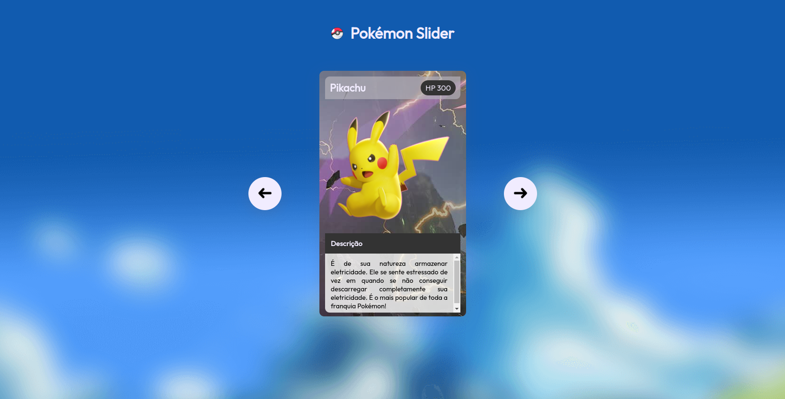

<h1 align="center"> Projeto Pokémon Slider </h1>

Projeto desenvolvido no evento Mapa Dev Week do Dev em Dobro.

  <a href="#-tecnologias">Tecnologias</a>&nbsp;&nbsp;&nbsp;|&nbsp;&nbsp;&nbsp;
  <a href="#-projeto">Projeto</a>&nbsp;&nbsp;&nbsp;|&nbsp;&nbsp;&nbsp;
  <a href="#memo-licença">Licença</a>

  

 

  

## 🚀 Tecnologias

Esse projeto foi desenvolvido com as seguintes tecnologias:

- HTML e CSS
- JavaScript
- Git e Github

## 💻 Projeto

Projeto construído no evento Mapa Dev Week do Dev em Dobro.

- [Acesse o projeto finalizado, online](https://gabriellricardoo.github.io/projeto-pokemon-slider-mdw/)

## :memo: Licença

Esse projeto está sob a licença MIT.

---

Feito com ♥ by GR
